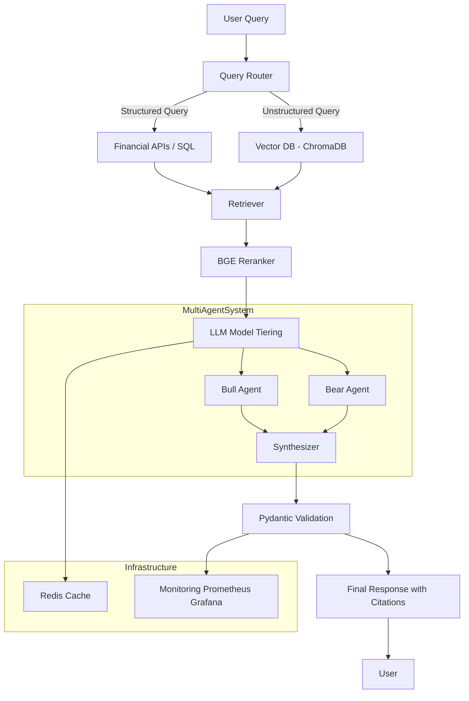

# 📈 AI Investment Research Assistant (AIRA)


---

> ⚡ Production-grade Multi-Source RAG System with Type-Safe AI Agents for Financial Intelligence

---

## 🚀 Overview

**AIRA (AI Investment Research Assistant)** is a production-grade, multi-source **Retrieval-Augmented Generation (RAG)** system designed to provide **accurate, explainable, and structured financial insights**.

Unlike traditional AI chatbots, AIRA focuses on:
- ❌ Eliminating hallucinations  
- ✅ Delivering validated structured outputs  
- 📊 Providing explainable reasoning with citations  

---

## 🎯 Key Features

- ✅ **Type-Safe AI Agents** using Pydantic (structured outputs only)
- 🔀 **Multi-Source RAG** (SQL/API + Vector DB)
- 🧠 **Explainable AI (XAI)** with logic chains & citations
- ⚡ **60% Cost Optimization** via caching + model tiering
- 🛠️ **Production-Ready MLOps Architecture**
- 🔒 **Safety Guardrails (No financial advice / PII protection)**

---
## 🏗️ Tech Stack

| Layer            | Technology Used                 |
|------------------|--------------------------------|
| Orchestration    | PydanticAI                    |
| API Layer        | FastAPI                       |
| LLM Routing      | LiteLLM                       |
| Vector Database  | ChromaDB                      |
| Primary DB       | MongoDB                       |
| Cache Layer      | Redis                         |
| Data Sources     | Alpha Vantage, NewsAPI, PDFs  |
| Deployment       | Docker + AWS                  |
| Monitoring       | Prometheus + Grafana          |

---
## 📂 Project Structure

```text
├── app/
│   ├── agents/      # Multi-agent logic (Bull, Bear, Synthesizer) & specialized prompts
│   ├── api/         # FastAPI endpoints and route controllers
│   ├── core/        # Global configuration, safety guardrails, and security layers
│   ├── db/          # Database connectors (MongoDB) and Vector Search logic
│   ├── schemas/     # Pydantic models for strict type-safe AI validation
│   └── services/    # Core RAG engine, financial API integrations, and BGE reranker
├── data/            # Local storage for financial PDFs and unstructured documents
├── tests/           # Comprehensive Pytest suite for unit and integration testing
├── .env.example     # Template for environment variables
├── Dockerfile       # Containerization instructions
├── docker-compose.yml # Multi-container orchestration (App, Redis, Mongo)
└── requirements.txt # Project dependencies
```


## 🏗️ System Architecture

### 🔹 Visual Diagram


### 🔹 Mermaid Diagram


```text
User Query
   ↓
Query Router (Intent Classification)
   ↓
 ┌───────────────┬────────────────┐
 │ Structured     │ Unstructured   │
 │ Data (SQL/API) │ Data (VectorDB)│
 └───────────────┴────────────────┘
   ↓
Retriever + BGE Reranker
   ↓
LLM (Model Tiering)
   ↓
Validated Output (Pydantic Schema)
```

## ⚙️ Core Features Explained

### 🔹 Type-Safe AI (Zero Hallucination)
- Enforces strict schemas using **Pydantic**
- Prevents invalid outputs (e.g., incorrect financial metrics)
- Guarantees structured **JSON responses**

---

### 🔹 Multi-Source RAG

| Query Type       | Source        |
|-----------------|--------------|
| Stock Prices     | API / SQL    |
| Financial News   | Vector DB    |
| Reports (PDFs)   | Embeddings   |

---

### 🔹 Explainable AI (XAI)
- Source citations included  
- Transparent reasoning chain  
- Confidence indicators  

---

### 🔹 Cost Optimization (~60%)
- 🧠 **Semantic Caching (Redis)**
- ✂️ **Context Pruning (Top-K retrieval)**
- 🤖 **Model Tiering:**
  - `gpt-4o-mini` → lightweight tasks  
  - `gpt-4o` → complex reasoning  

---

### 🔹 Advanced RAG Enhancements
- 🔍 **BGE Reranker** → improves retrieval accuracy  
- 🧠 **HyDE Retrieval** → better semantic understanding  
- 🔀 **Dynamic Query Router**

---

### 🔹 MLOps & Observability
- 📊 **RAGAS evaluation metrics**  
- 🔎 **LangSmith tracing**  
- 📈 **Prometheus + Grafana monitoring**  
- 🔁 **CI/CD via GitHub Actions**

---

### 🔹 Safety & Compliance
- 🚫 No buy/sell financial advice  
- 🔒 PII protection layer  
- ⚠️ AI confidence scoring  

---

### 🔹 Multi-Agent System
- 🐂 **Bull Agent** (positive analysis)  
- 🐻 **Bear Agent** (negative analysis)  
- ⚖️ **Final Synthesizer Agent**

---

## 🛠️ Installation & Setup

### 1️⃣ Clone Repository
```bash
git clone https://github.com/your-username/aira.git
cd aira
```
### 2️⃣ Create Virtual Environment
```bash
python -m venv .venv
.venv\Scripts\activate   # Windows
```
### 3️⃣ Install Dependencies
```bash
pip install -r requirements.txt
```
### 4️⃣ Setup Environment Variables
```bash
OPENAI_API_KEY=your_key
ALPHA_VANTAGE_API_KEY=your_key
NEWS_API_KEY=your_key
MONGO_URI=your_mongo_uri
REDIS_URL=your_redis_url
```
### 5️⃣ Run Application
```bash
uvicorn app.main:app --reload
```
### 6️⃣ Run with Docker
```bash
docker-compose up --build
```
## 🧪 Testing
### Run test suite
```bash
pytest tests/
```
## 📊 Example Use Cases

- 📈 Stock trend analysis  
- 📰 Financial news summarization  
- 📑 Investment report extraction  
- 🔍 Multi-source reasoning  

---

## 🚀 Future Improvements

- [ ] Real-time dashboard  
- [ ] Portfolio recommendation engine  
- [ ] Mobile app integration  
- [ ] Deep learning forecasting (LSTM/Transformers)  

---

## 👨‍💻 Author

**Dinesh**  

- Aspiring AI/ML Engineer  
- Focus: RAG Systems, LLMs, Production AI  